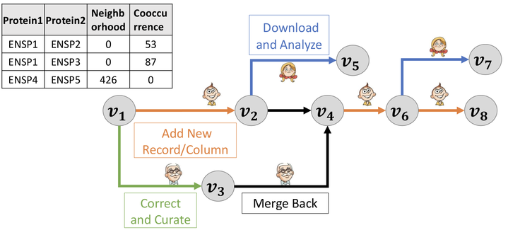
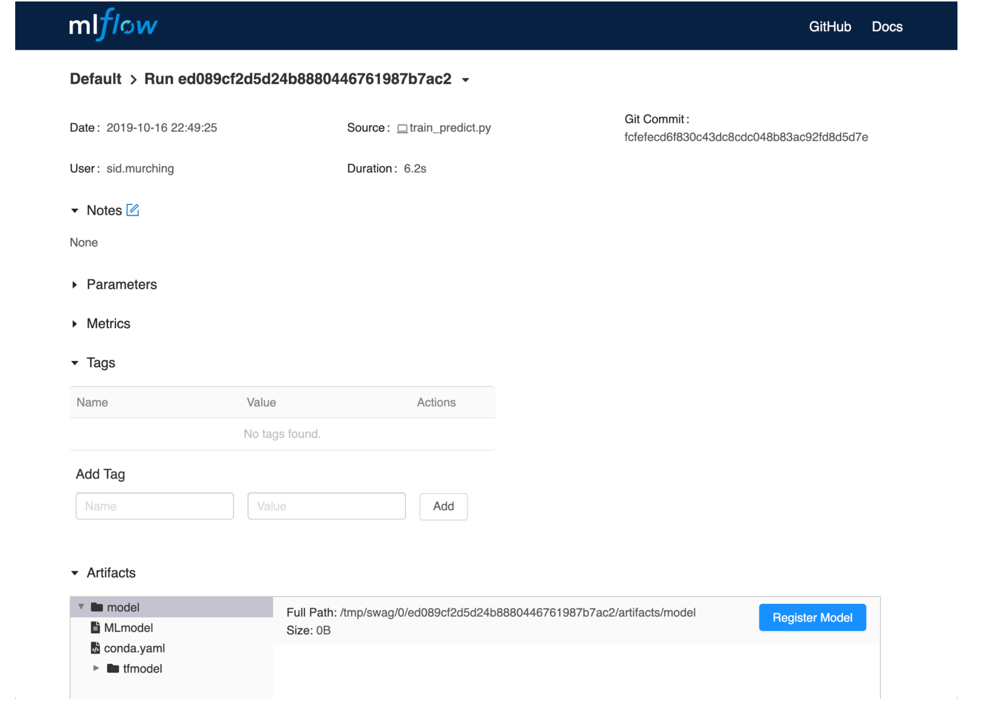

# **MLSD Workshop**

## **Model Versioning (with DVC tasks)**

Model versioning is a set of practices and tools that enable tracking, managing, and reproducing machine learning models throughout their lifecycle. It’s a critical aspect of ML system design, particularly in production workflows where models evolve over time and need to be managed efficiently.

### **Why Model Versioning Matters?**

1. **Traceability**:
    * Link each model version to the corresponding dataset, code, and environment.
    * Helps debug issues by reproducing past versions.
2. **Collaboration**:
    * Enable teams to work on multiple versions simultaneously without conflicts.
    * Share specific model versions with stakeholders.
3. **Reproducibility**:
    * Reproduce model results by matching the exact data, hyperparameters, and code.
4. **Deployment**:
    * Safely roll back to a previous model version if a new version underperforms in production.
    * Track which version is deployed and monitor its performance.

### **Best Practices for Model Versioning**

One of the best practices in model versioning is to *version all artifacts, including datasets, preprocessing scripts, model weights, and configuration files*. Each version should be *immutable*, meaning that once a version is created, it cannot be altered. This ensures a reliable record of the project’s evolution. Adopting *semantic versioning schemes*, such as major.minor.patch (e.g., 1.0.2), helps teams communicate the nature of changes: major updates for breaking changes, minor updates for feature additions, and patches for bug fixes or small optimizations. *Metadata management* is another essential practice, where each model version includes details about the dataset used, the training pipeline, and evaluation results. *Centralized storage*, such as a *model registry*, is crucial for organizing and accessing these versions.

List of tools and libraries: [DVC](https://dvc.org), [MLflow](https://mlflow.org), [Weights & Biases (W&B)](https://wandb.ai), [Pachyderm](https://www.pachyderm.com), [TensorFlow Model Management (TF-Serving & TF-Hub)](https://www.tensorflow.org/tfx/guide/serving) and [Hugging Face Hub](https://huggingface.co).

### **Why DVC?**

From the official [DVC documentation](https://dvc.org/doc):

* *Handles Large Files: Git struggles with large files. DVC uses .dvc files to reference data stored locally or remotely.*
* *Experiment Reproducibility: Links datasets, models, and experiments.*
* *Remote Storage Support: Easily push datasets/models to cloud storage (e.g., AWS S3, Google Drive).*

Example Scenario:

* Your training dataset grows over time.
* You release multiple model versions.
* You want to link each model to the exact dataset and code used.

**Several tasks to get into DVC:**

* [Task 1 - Intro to DVC](1_model_versioning/task1_intro_to_dvc/README.md)
* [Task 2 - Advanced DVC](1_model_versioning/task2_advanced_dvc/README.md)

## **Experiment Tracking (with MLflow tasks)**

Experiment tracking is the practice of recording the details of machine learning experiments, including parameters, metrics, models, and datasets. It helps data scientists and engineers understand what worked, what didn’t, and why. By systematically logging experiments, teams can collaborate effectively, ensure reproducibility, and make data-driven decisions about model improvements.

### **Why Experiment Tracking Matters?**

1. **Organization:**
    * Keep a record of all experiments in one place.
    * Avoid the chaos of manual logging or relying on memory.
2. **Reproducibility:**
    * Reproduce any experiment by using the exact parameters, dataset, and code.
    * Ensure consistency across team members.
3. **Comparison:**
    * Compare different experiments to identify the best-performing models.
    * Visualize the impact of hyperparameter tuning.
4. **Collaboration:**
    * Share results with stakeholders or team members.
    * Work collaboratively without losing track of progress.

Tools like [MLflow](https://mlflow.org), [Weights & Biases (W&B)](https://wandb.ai), and [Neptune.ai](https://neptune.ai/) provide powerful solutions for experiment tracking.

### **Why MLflow?**

From the official MLflow documentation:

* *Logging Experiments: Automatically track parameters, metrics, and artifacts for each experiment.*
* *User Interface: View, search, and compare experiments in a web-based UI.*
* *Framework Agnostic: Compatible with frameworks like TensorFlow, PyTorch, Scikit-learn, and more.*
* *Model Registry: Manage the lifecycle of models, from development to production.*
* *Deployment Options: Deploy models with Docker, Kubernetes, or cloud platforms.*

Example Scenario:

* You’re tuning hyperparameters for a machine learning model.
* MLflow helps log each set of hyperparameters, the resulting metrics, and the model artifacts.
* The UI allows you to compare experiments and identify the best-performing configuration.

**Several tasks to dive into MLflow:**

* [Task 1 - Intro to MLflow](2_experiment_tracking/task1_intro_to_mlflow/README.md)
* [Task 2 - Advanced MLflow](2_experiment_tracking/task2_advanced_mlflow/README.md)

## **Reproducibility (with Docker and Conda tasks)**

Reproducibility ensures that machine learning experiments yield consistent results regardless of where or when they are executed. It is critical in ML workflows for debugging, collaboration, and deploying reliable models in production.

### **Why Reproducibility Matters?**

1. **Consistency:**
    * Avoid discrepancies in results due to differing environments or software versions.
    * Ensure the same results on local and production systems.
2. **Debugging:**
    * Recreate past experiments to understand and fix issues.
    * Pinpoint the cause of model underperformance or errors.
3. **Collaboration:**
    * Share environments with teammates to ensure everyone is working under the same conditions.
    * Provide stakeholders with reproducible results for validation.
4. **Deployment:**
    * Deploy models with confidence, knowing they will perform consistently in production.

### **Best Practices for Reproducibility**

1. **Pin Dependencies:** Specify exact versions of all libraries and tools in a requirements.txt or environment.yml file.
2. **Use Containers:** Containerize your ML project with Docker to ensure the environment is consistent across systems.
3. **Version Everything:** Track datasets, code, and configurations systematically.
4. **Control Randomness:** Set seeds for random operations to ensure reproducible results.
5. **Automate Setup:** Use scripts to automate the creation of reproducible environments (e.g., Dockerfile, Conda).

### **Why Docker and Conda?**

* Docker: Provides a lightweight, portable containerization solution for packaging and deploying applications. It ensures the exact same environment across development and production.

    From the Docker documentation:

    * *Docker provides a consistent environment by bundling application code, dependencies, and configurations into a container.*

* Conda: A package manager that creates isolated environments, allowing you to specify the exact versions of Python, libraries, and tools.

    From the Conda documentation:

    * *Conda environments make it simple to recreate environments across different machines or share with teammates.*

Example Scenario:

* Your model underperforms in production, but it worked fine locally. Docker allows you to replicate your local environment in production, ensuring the issue is not due to environmental differences.

**Several tasks to explore reproducibility:**

* [Task 1 - Intro to Docker](3_reproducibility/task1_docker_intro/README.md)
* [Task 2 - Using Conda Environments](3_reproducibility/task2_conda_envs/README.md)